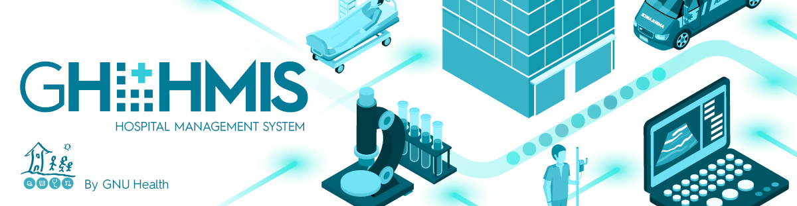

==================
 |GNU Health HMIS|
==================

.. Note:: This document is licensed under Creative Commons
    Attribution-ShareAlike 4.0 International (CC BY-SA 4.0)

:Author: Luis Falcon
:Contact: info@gnuhealth.org
:Version: 4.0.0

.. contents::

Introduction
============
Humanity is heading towards extinction. We need an immediate, radical change of
paradigm if we want to avoid the grim future ahead of us. Regardless of the
remarkable achievements in science and technology, the social gradient and
concentration of power are at highest levels. Thousands of children will die
today from preventable diseases. The alarming levels of child labor, homeless
people, human trafficking and sex slavery, family violence, child abuse or
addiction to -licit and illicit- drugs are social diseases from sick societies
in the global North and South.

Our planet is hurting. Humans keep destroying the Amazon an African rainforests.
Oceans are full of plastic and fishing nets. An appalling ecocide in front of
our very own eyes. Billions of sentient animals are separated from their
mothers, enslaved, jailed in overcrowded in filthy and undignifying conditions.
They will spend the rest of their lives in these deplorable conditions, until
the day someone will slit their throat.

This cruelty comes with a price: antibiotic resistance, global warming,
pollution of our seas and rivers, epidemics and chronic diseases are some of
them. The COVID pandemic has been a humbling reminder from Mother Nature to the
arrogant, selfish and cruel human being.

The incidence of non-communicable diseases is rising at an alarming rate:
obesity, diabetes, cardiovascular disease, cancer, neurodegenerative diseases,
autoimmune conditions and mental illness represent not only a disruption of our
physiological balance. Often, they represent the end result of a dysfunctional
political and economic model. Chronic stress, sleep deprivation, sedentarism,
ultra-processed food and polluted with pesticides are, without a doubt, behind
many of these multi-factorial and devastating illnesses.

There is hope. We must abolish this reactive and reductionist *System of
Disease*, and embrace a sustainable *System of Health*, the model that GNU
Solidario [#gnusolidario]_ proposes, and that is present in the GNU Health
ecosystem.

Health is a non-negotiable human right. The System of Health means moving
away from the current anthropocentric, oppressive, capitalist system.
Proper education, nutrition, housing and sanitary conditions are indispensable
for a healthy individual, family and society.  The dismantling of the public
health care system in favor of private insurance from financial institutions
must stop, so health does not become a privilege of a few.

GNU Health [#gnuhealth]_ is, first and foremost, a social project.
GNU Health is disruptive. It's about changing the status-quo and placing people
before patients. About integrating health professionals back into the community.
About listening to the person we have in front of us. About empathy,
compassion human factor that must be present in art and science of Medicine, and
that can never be replaced by technology.

I started the GNU Health project in 2008 to improve Primary Health Care (PHC)
in rural communities. Today GNU Health has grown to a full digital health
ecosystem, that but the spirit of social medicine. GNU Health is putting
state of the art technology to the betterment of our society. From primary care
to medical genetics and precision medicine. From the socioeconomic
determinants of health, to the molecular basis of disease, and the
effect of the exposome.

GNU Health is the GNU Libre Digital Health ecosystem. Its components provide
the functionality of a Hospital Management Information
System (HMIS), a Lab Information System (LIMS), a Personal Health Record
(MyGNUHealth) and a federated health network, among others.

The GNU Health Book of Life introduce a new, trans-disciplinary way of medicine.
Our health is much more than just cold medical records. Most of the time, our
health is the result of many events related to the environment, decisions we
make, and interactions with many actors, that shape our life as individuals.
Thanks to MyGNUHealth, the GNUHealth Personal Health record, the individual can
now keep track of their health, and interact with their health professionals
from their mobile phone or desktop.

GNU Health enables interdisciplinary work and collaboration among health
professionals. The GNU Health Federation creates nation-wide networks of people,
hospitals, clinicians and research institutions. The information is gathered in
massive health databases, providing the health authorities a timely and accurate
observatory. This results in better health promotion and disease prevention
campaigns, and in early detection of infectious diseases outbreaks.

GNU Health is a mature project with a large and friendly international
community. Throughout these years, GNU Health implementations in clinics,
hospitals and research institutions around the globe have provided help to
millions of individuals and their families.

This book will focus on the Hospital and Laboratory Management components of GNU
Health. The other components of the GNU Health ecosystem (MyGNUHealth, Thalamus,
the GNU Health Federation) will have their own guides.

I sincerely hope you enjoy this book. Most importantly, I hope you find it
inspirational and join us in the fight for the betterment of our society.

Luis Falcon, MD Founder, GNU Solidario

**A call for Open Science**
Science can not evolve if the information is kept in private hands. If we, as a
society and as a scientific community, want to find solutions for
neuro-degenerative diseases, cancer, autoimmune conditions, metabolic and
genetic disorders, we need open science.

The GNU Health ecosystem and its international community provide the key for
boosting the research in bioinformatics, social medicine and public health. We
need our governments to use Free/Libre software in the public administration,
particularly, in the education and public health systems.

**The need for a Kinder Science**
Last but not least, we need to work on human-relevant, animal free research.
Science can not be complicit in the enslaving, torture and killing of millions
of innocent beings in laboratories around the world. Speciesism and any other
type of discrimination (racism, sexism,..) are appalling and must be abolished.
In 2020 I signed with other scientists an open letter lead by Animal Free
Research UK, a call to accelerate human-focussed medical research
[#kinderscience]_. Today there are safer, effective and cruelty-free
alternatives. Let's embrace them.

**Contact**

You can contact us at info@gnuhealth.org

Our home page is https://www.gnuhealth.org

GNU Health HMIS functionality
=============================

The main areas of GNU Health Hospital Management compnent are:

* **Community management**: demographics, domiciliary
  units, families, operational sectors, socioeconomics,...
* **Patient management (EMR)**: encounters, health evaluations,
  hospitalizations, clinical history, ...
* **Health center management (HMIS)**: Financial management, stock &
  pharmacy, human resources, ...
* **Laboratory Management (LIS)**: lab test orders, workflows, analyzer
  interfaces,  reports
* **Health Information System**: Reporting, demographics and epidemiology

These areas involve multi-disciplinary teams, with different responsibilities.
For example, demographics and status of the domiciliary units
(DU) can be collected by social workers. The patient management by health
professionals, the health center management by administrative personnel and
accountants, and the information produced by the health center can be
processed and managed by the health authorities.

This is just an example to show the importance of team work in GNU Health to get
the best results in your community.

.. rubric:: Footnotes
.. [#gnuhealth] The Libre Digital Health ecosystem - https://www.gnuhealth.org
.. [#gnusolidario] Advancing Social Medicine - https://www.gnusolidario.org
.. [#kinderscience] A call to accelerate human-focussed medical research
                    https://www.animalfreeresearchuk.org/openletter/

